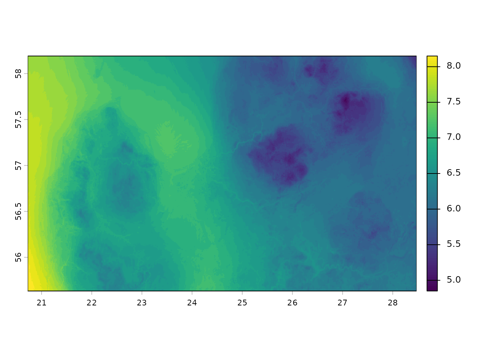
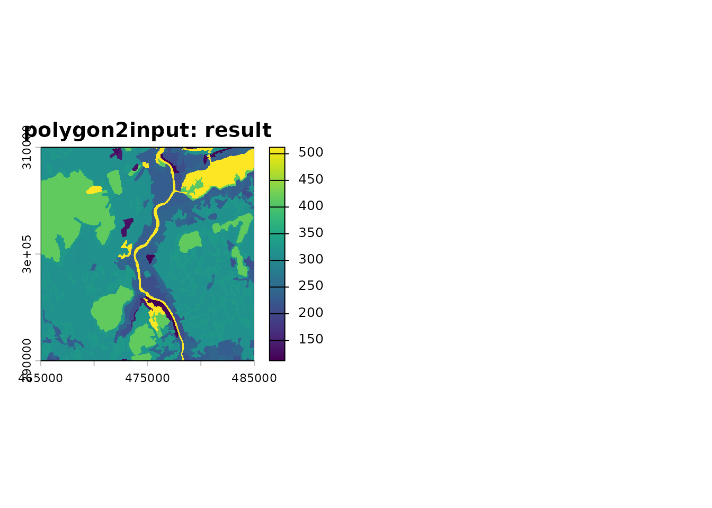
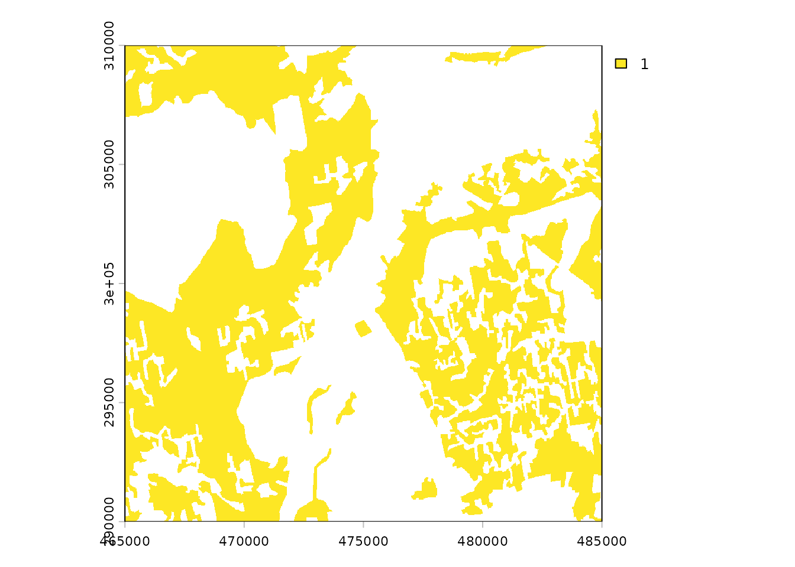
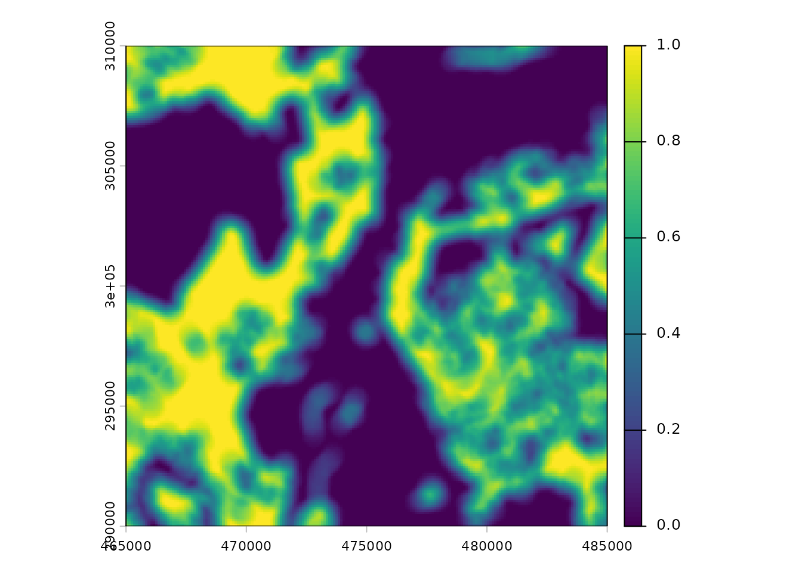
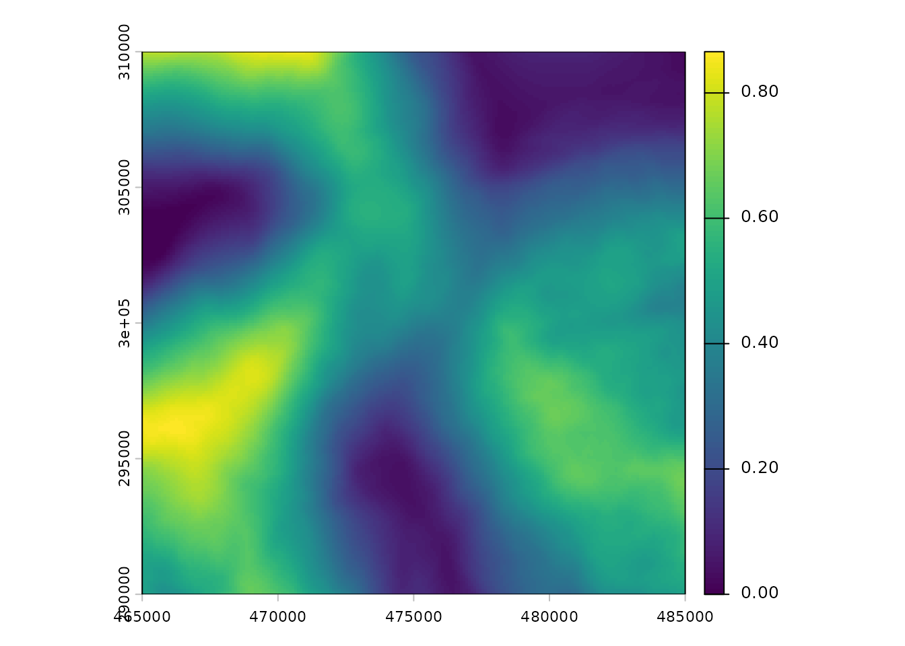
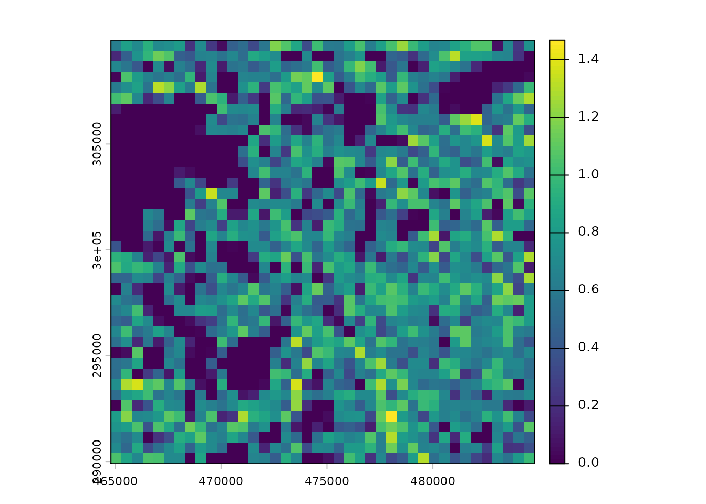
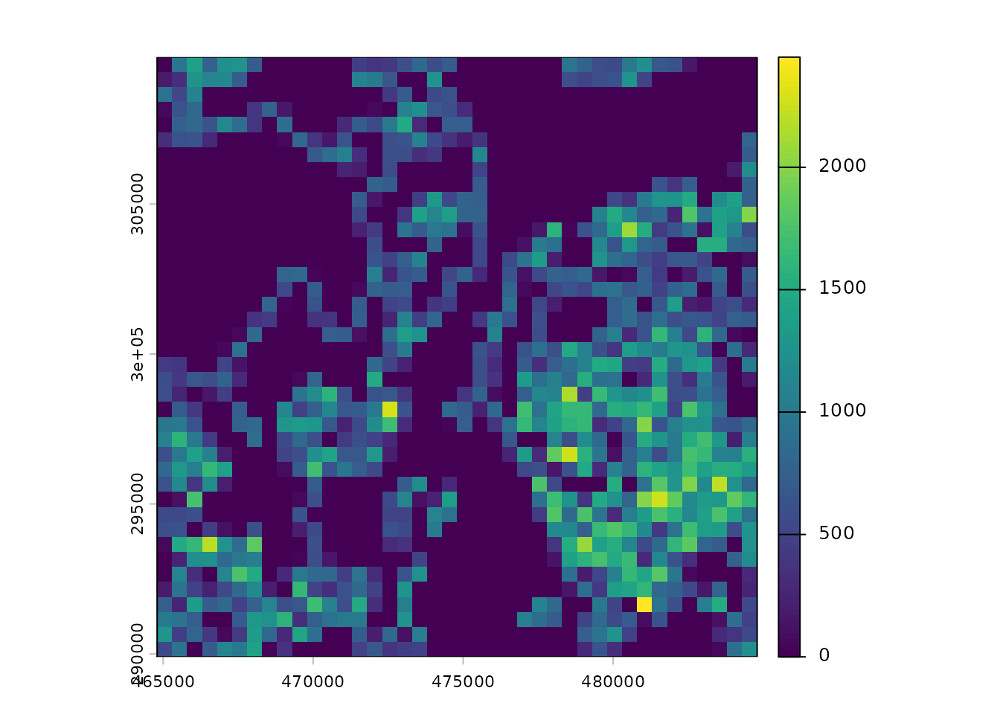

# Introduction to egvtools

``` r

library(egvtools)
library(sf)
#> Linking to GEOS 3.12.1, GDAL 3.8.4, PROJ 9.4.0; sf_use_s2() is TRUE
library(terra)
#> terra 1.9.50
library(sfarrow)
library(landscapemetrics)
```

## Overview

`egvtools` provides tools for reproducible preparation of
high-resolution ecogeographical variables (EGVs) from heterogeneous
spatial data. The package is primarily intended for ecological
applications in which environmental information from multiple sources
must be transformed into spatially aligned, analysis-ready raster
layers, for example as predictors in species distribution models (SDMs).

Species distribution models relate observations of species occurrence or
abundance to environmental conditions and are widely used to describe
species-environment relationships and predict distributions across space
and time ([Elith and Leathwick 2009](#ref-elith2009)). Consequently, the
quality, ecological relevance, spatial resolution, and spatial scale of
environmental predictors are important parts of the modelling workflow.

The main purpose of `egvtools` is not to replace general-purpose spatial
software. Instead, it provides wrappers and utilities for recurring
operations in large EGV-production workflows, including rasterization,
grid harmonization, aggregation, distance calculations, multi-scale
summaries, landscape metrics, and preparation of reusable spatial
templates. The package builds on established R spatial infrastructure,
particularly `terra`, `sf`, `sfarrow`, `exactextractr`,
`landscapemetrics`, and `whitebox` ([Pebesma 2018](#ref-pebesma2018);
[Hesselbarth et al. 2019](#ref-hesselbarth2019); [Lindsay
2016](#ref-lindsay2016)).

A particular emphasis is placed on reproducibility. Raster origin,
resolution, extent, coordinate reference system (CRS), grid-cell
locations, and naming conventions are kept consistent across processing
steps. This is especially important when large collections of predictors
are produced independently and later combined into a common modelling
dataset.

The workflow implemented in `egvtools` builds on previous work
developing multi-scale EGVs for species distribution modelling in Latvia
([Avotins et al. 2022](#ref-avotins2022)). Although the examples in this
vignette use Latvian template grids, the underlying functions can also
be applied to other study areas when suitable reference grids and raster
templates are provided.

The package was developed within the project HiQBioDiv: High-resolution
quantification of biodiversity for conservation and management, funded
by the Latvian Council of Science (Ref. No. VPP-VARAM-DABA-2024/1-0002).

The development version can be installed from GitHub with:

``` r

# install.packages("remotes")
remotes::install_github("aavotins/egvtools")
```

Spatial data processing terminology varies among disciplines and
projects. For clarity, `egvtools` uses the following operational terms
throughout its documentation. These describe stages of the
EGV-production workflow rather than formal or universal GIS data
categories.

- **Raw geodata** are source data obtained to describe environmental
  conditions. They may be tables containing coordinates, raster
  datasets, or vector datasets such as points, lines, and polygons. Raw
  geodata may already have undergone basic preprocessing by their data
  provider, but they have not yet been harmonized specifically for the
  EGV workflow.

- **Geodata products** are intermediate datasets derived from one or
  more raw geodata sources through substantial spatial processing. Such
  processing may include overlays, reclassification, prioritization
  among overlapping datasets, or combination of several data sources. In
  the workflows described here, geodata products are commonly
  categorical raster layers with a defined CRS, resolution, origin, and
  cell alignment.

Creating a geodata product can be important when overlapping source
datasets require explicit decisions about which spatial class takes
precedence. For example, a high-resolution raster cell cannot
simultaneously represent both open water and forest when a subsequent
analysis requires an unambiguous forest–water boundary.

- **Input data or input layers** are high-resolution raster layers used
  directly to calculate EGVs. Their spatial resolution is commonly finer
  than the final EGV resolution. Working with harmonized raster inputs
  makes many repeated operations considerably simpler and faster because
  decisions about projection, alignment, overlaps, and class precedence
  have already been resolved.
- **Ecogeographical variables (EGVs)** are the analysis-ready
  environmental variables produced by the workflow. They describe
  environmental conditions, landscape composition, configuration,
  distance, diversity, or related characteristics on a common spatial
  grid. EGVs can consequently be combined directly with occurrence or
  other ecological data in statistical analyses, including species
  distribution models. Multi-scale EGVs can additionally represent
  environmental characteristics surrounding a focal grid cell at several
  spatial scales ([Avotins et al. 2022](#ref-avotins2022); [Bradter et
  al. 2013](#ref-bradter2013)).

In simplified form, the workflow can therefore be represented as:

**raw geodata -\> geodata products -\> harmonized input layers -\>
EGVs**

Not every dataset must pass through every stage. For example, a
continuous climate raster may be converted directly from raw geodata to
an EGV, whereas several overlapping land-cover datasets may first need
to be combined into a geodata product.

## Example data

Several small example datasets are included with `egvtools`. They are
intended to demonstrate the workflow without requiring the full national
datasets used in production analyses.

The examples below use harmonized raster and vector grids, grid
centroids, climate data, and Land Use Land Cover (LULC) information
represented by (CORINE Land Cover
2018)\[<https://land.copernicus.eu/en/products/corine-land-cover/clc2018>\].

CORINE Land Cover provides a harmonized European land-cover
classification and is used here as a readily interpretable categorical
landscape dataset. The example data are intended to demonstrate
`egvtools`; users should select source datasets with spatial and
thematic resolution appropriate to their own ecological questions.

``` r

data("clc18", package = "egvtools")
```

Raster example data distributed with the package are stored in
`inst/extdata` and can be accessed using
[`system.file()`](https://rdrr.io/r/base/system.file.html).

``` r

climate_file <- system.file("extdata",
                        "Climate.tif",
                        package = "egvtools")

climate=terra::rast(climate_file)
terra::plot(climate)
```



The example data distributed with the package are deliberately small.
The full harmonization templates used for national processing can
instead be downloaded from Zenodo:

- (vector data)\[<https://doi.org/10.5281/zenodo.14237929>\];

- (raster data)\[<https://doi.org/10.5281/zenodo.14494873>\].

These templates define the spatial reference used throughout the
workflow, including CRS, raster origin, resolution, cell alignment, and
identifiers used for tiled processing.

``` r

pkg_extdata <- system.file(
  "extdata",
  package = "egvtools"
)

grid_path100 <- file.path(
  pkg_extdata,
  "Templates",
  "TemplateGrids",
  "tikls100_sauzeme.parquet"
)

grid_path500 <- file.path(
  pkg_extdata,
  "Templates",
  "TemplateGrids",
  "tikls500_sauzeme.parquet"
)

template_path100 <- file.path(
  pkg_extdata,
  "Templates",
  "TemplateRasters",
  "LV100m_10km.tif"
)

template_path10 <- file.path(
  pkg_extdata,
  "Templates",
  "TemplateRasters",
  "LV10m_10km.tif"
)

template_path500 <- file.path(
  pkg_extdata,
  "Templates",
  "TemplateRasters",
  "LV500m_10km.tif"
)


work_dir <- file.path(tempdir(), "egvtools_vignette")
dir.create(work_dir, recursive = TRUE, showWarnings = FALSE)
```

## Reproducibility functions

Large spatial workflows are vulnerable to subtle inconsistencies among
datasets. Two rasters may have the same nominal resolution and CRS while
still having different origins or cell boundaries, making direct
cell-by-cell operations inappropriate.

For this reason, `egvtools` uses reusable vector and raster templates to
define the geometry of an analysis. The template download functions
provide a convenient way to recreate the same spatial framework on
another computer or in a new project directory.

#### Downloading vector templates

[`download_vector_templates()`](https://aavotins.github.io/egvtools/reference/download_vector_templates.md)
downloads the reference grids and point layers used for tiled and
multi-scale calculations.

``` r

download_vector_templates(url="https://zenodo.org/api/records/22912421/files-archive",
  grid_dir = "../Templates/TemplateGrids",
  points_dir = "../Templates/TemplateGridPoints",
  gpkg_dir = "../Templates",
  overwrite = TRUE,
  quiet = FALSE)
```

#### Downloading raster templates

[`download_raster_templates()`](https://aavotins.github.io/egvtools/reference/download_raster_templates.md)
retrieves the corresponding raster templates. Together, the vector and
raster templates allow independently generated EGVs to retain exactly
the same spatial geometry.

``` r

download_raster_templates(url="https://zenodo.org/api/records/22912630/files-archive",
  out_dir = "../Templates/TemplateRasters",
  overwrite = TRUE,
  quiet = FALSE)
```

## Preparing for core workflows

National-scale processing can involve millions of grid cells and very
large input datasets. `egvtools` therefore supports dividing
calculations into spatial tiles and reassembling the results afterwards.

#### Tiling reference grids

[`tile_vector_grid()`](https://aavotins.github.io/egvtools/reference/tile_vector_grid.md)
divides a reference grid according to an existing tile identifier. This
allows subsequent calculations to operate on manageable subsets instead
of repeatedly loading the complete national grid.

``` r


tiles_grid <- file.path(
  work_dir,
  "TemplateGrids",
  "tiles"
)

dir.create(
  tiles_grid,
  recursive = TRUE,
  showWarnings = FALSE
)

tile_vector_grid(
  grid_path = grid_path100,
  out_dir = tiles_grid,
  tile_field = "tks50km",
  overwrite = TRUE,
  quiet = FALSE)
#> Spherical geometry (s2) switched off
#> Tiling by ' tks50km ' with  4  tiles.
#> Warning: This is an initial implementation of Parquet/Feather file support and
#> geo metadata. This is tracking version 0.1.0 of the metadata
#> (https://github.com/geopandas/geo-arrow-spec). This metadata
#> specification may change and does not yet make stability promises.  We
#> do not yet recommend using this in a production setting unless you are
#> able to rewrite your Parquet/Feather files.
#> Wrote:  tikls100_3243.parquet  ( 10100  rows)
#> Warning: This is an initial implementation of Parquet/Feather file support and
#> geo metadata. This is tracking version 0.1.0 of the metadata
#> (https://github.com/geopandas/geo-arrow-spec). This metadata
#> specification may change and does not yet make stability promises.  We
#> do not yet recommend using this in a production setting unless you are
#> able to rewrite your Parquet/Feather files.
#> Wrote:  tikls100_3244.parquet  ( 10302  rows)
#> Warning: This is an initial implementation of Parquet/Feather file support and
#> geo metadata. This is tracking version 0.1.0 of the metadata
#> (https://github.com/geopandas/geo-arrow-spec). This metadata
#> specification may change and does not yet make stability promises.  We
#> do not yet recommend using this in a production setting unless you are
#> able to rewrite your Parquet/Feather files.
#> Wrote:  tikls100_4221.parquet  ( 10100  rows)
#> Warning: This is an initial implementation of Parquet/Feather file support and
#> geo metadata. This is tracking version 0.1.0 of the metadata
#> (https://github.com/geopandas/geo-arrow-spec). This metadata
#> specification may change and does not yet make stability promises.  We
#> do not yet recommend using this in a production setting unless you are
#> able to rewrite your Parquet/Feather files.
#> Wrote:  tikls100_4222.parquet  ( 10302  rows)
```

#### Preparing multi-scale buffers

Ecological relationships are frequently scale-dependent. Environmental
conditions immediately surrounding an observation may describe local
habitat, whereas conditions measured over larger neighbourhoods can
describe landscape composition, habitat availability, fragmentation, or
broader ecological processes. Evaluating predictors at more than one
spatial scale can therefore be important in species distribution
modelling ([Bradter et al. 2013](#ref-bradter2013)).

[`tiled_buffers()`](https://aavotins.github.io/egvtools/reference/tiled_buffers.md)
prepares reusable buffer geometries around grid-cell centroids. Because
these geometries are created once and subsequently reused for many input
variables, this can substantially reduce duplicated spatial processing.

``` r

in_dir <- system.file(
  "extdata",
  "Templates",
  "TemplateGridPoints",
  package = "egvtools"
)

out_path_buff <- file.path(
  work_dir,
  "TemplateGridPoints",
  "tiles"
)

dir.create(
  out_path_buff,
  recursive = TRUE,
  showWarnings = FALSE
)


tiled_buffers(
  in_dir = in_dir,
  out_dir = out_path_buff,
  buffer_mode = "dense",
  radii_dense = c(500, 3000),
  split_field = "tks50km",
  n_workers = 2,
  future_max_mem_gb = 4,
  overwrite = TRUE,
  quiet = FALSE
)
#> Spherical geometry (s2) switched off
#> Warning: This is an initial implementation of Parquet/Feather file support and
#> geo metadata. This is tracking version 0.1.0 of the metadata
#> (https://github.com/geopandas/geo-arrow-spec). This metadata
#> specification may change and does not yet make stability promises.  We
#> do not yet recommend using this in a production setting unless you are
#> able to rewrite your Parquet/Feather files.
#> Warning: This is an initial implementation of Parquet/Feather file support and
#> geo metadata. This is tracking version 0.1.0 of the metadata
#> (https://github.com/geopandas/geo-arrow-spec). This metadata
#> specification may change and does not yet make stability promises.  We
#> do not yet recommend using this in a production setting unless you are
#> able to rewrite your Parquet/Feather files.
#> Warning: This is an initial implementation of Parquet/Feather file support and
#> geo metadata. This is tracking version 0.1.0 of the metadata
#> (https://github.com/geopandas/geo-arrow-spec). This metadata
#> specification may change and does not yet make stability promises.  We
#> do not yet recommend using this in a production setting unless you are
#> able to rewrite your Parquet/Feather files.
#> Warning: This is an initial implementation of Parquet/Feather file support and
#> geo metadata. This is tracking version 0.1.0 of the metadata
#> (https://github.com/geopandas/geo-arrow-spec). This metadata
#> specification may change and does not yet make stability promises.  We
#> do not yet recommend using this in a production setting unless you are
#> able to rewrite your Parquet/Feather files.
#> Spherical geometry (s2) switched off
#> Warning: This is an initial implementation of Parquet/Feather file support and
#> geo metadata. This is tracking version 0.1.0 of the metadata
#> (https://github.com/geopandas/geo-arrow-spec). This metadata
#> specification may change and does not yet make stability promises.  We
#> do not yet recommend using this in a production setting unless you are
#> able to rewrite your Parquet/Feather files.
#> Warning: This is an initial implementation of Parquet/Feather file support and
#> geo metadata. This is tracking version 0.1.0 of the metadata
#> (https://github.com/geopandas/geo-arrow-spec). This metadata
#> specification may change and does not yet make stability promises.  We
#> do not yet recommend using this in a production setting unless you are
#> able to rewrite your Parquet/Feather files.
#> Warning: This is an initial implementation of Parquet/Feather file support and
#> geo metadata. This is tracking version 0.1.0 of the metadata
#> (https://github.com/geopandas/geo-arrow-spec). This metadata
#> specification may change and does not yet make stability promises.  We
#> do not yet recommend using this in a production setting unless you are
#> able to rewrite your Parquet/Feather files.
#> Warning: This is an initial implementation of Parquet/Feather file support and
#> geo metadata. This is tracking version 0.1.0 of the metadata
#> (https://github.com/geopandas/geo-arrow-spec). This metadata
#> specification may change and does not yet make stability promises.  We
#> do not yet recommend using this in a production setting unless you are
#> able to rewrite your Parquet/Feather files.
#> tiled_buffers complete. Wrote  8  /  8  files at  /tmp/RtmpIADrnF/egvtools_vignette/TemplateGridPoints/tiles
```

With `buffer_mode = "dense"`, buffers are created around the full set of
reference points for each requested radius. The appropriate radii should
be chosen according to the ecological processes and taxa being studied
rather than interpreted as universally applicable spatial scales.

#### Creating background rasters

Some transformations require an explicit value outside the features
represented by an input layer. For example, a binary habitat layer may
contain `1` for the target habitat and `NA` elsewhere, while an
aggregation operation requires non-target area to be represented by `0`.

[`create_backgrounds()`](https://aavotins.github.io/egvtools/reference/create_backgrounds.md)
creates raster backgrounds aligned with the reference templates. These
can subsequently be used to distinguish true zero values from missing
data.

``` r

in_dir <- system.file(
  "extdata",
  "Templates",
  "TemplateRasters",
  package = "egvtools"
)

out_path <- file.path(
  work_dir,
  "TemplateRasters"
)

dir.create(
  out_path,
  recursive = TRUE,
  showWarnings = FALSE
)


create_backgrounds(
  in_dir = in_dir,
  out_dir = out_path,
  background_value = 0,
  out_prefix="nulls_",
  overwrite = TRUE,
  terra_todisk = TRUE
)
#> Found 3 raster(s). Writing to: /tmp/RtmpIADrnF/egvtools_vignette/TemplateRasters 
#> [1/3] Processing: LV100m_10km.tif 
#>   -> Wrote: /tmp/RtmpIADrnF/egvtools_vignette/TemplateRasters/nulls_LV100m_10km.tif 
#> [2/3] Processing: LV10m_10km.tif 
#>   -> Wrote: /tmp/RtmpIADrnF/egvtools_vignette/TemplateRasters/nulls_LV10m_10km.tif 
#> [3/3] Processing: LV500m_10km.tif 
#>   -> Wrote: /tmp/RtmpIADrnF/egvtools_vignette/TemplateRasters/nulls_LV500m_10km.tif 
#> Done. Total elapsed: 0.6 sec
```

## Core analysis functionality

The core functions in `egvtools` implement several common
transformations from source spatial information to analysis-ready EGVs.
The examples below illustrate a typical sequence rather than a mandatory
pipeline. Individual functions can also be used independently.

### Polygons to harmonized inputs

Many environmental datasets are supplied as polygons, whereas repeated
high-resolution calculations are often more efficient once categorical
information has been converted to a common raster grid.

[`polygon2input()`](https://aavotins.github.io/egvtools/reference/polygon2input.md)
rasterizes vector features using an existing raster template. The
template determines the CRS, resolution, extent, origin, and cell
locations, ensuring that the resulting input raster is compatible with
other layers in the workflow.

``` r


clc18$code=as.numeric(clc18$code_18)
polygon2input(vector_data = clc18,
              template_path = template_path10,
              out_path = work_dir,
              file_name = "clc_classes.tif",
              value_field = "code",
              plot_result = TRUE,
              plot_gaps = TRUE,
              overwrite = TRUE)
#> Rasterizing polygons (fasterize) ...
#> Projection skipped (grids already aligned).
#> Missing cells before restrict/cover: 0 
#> Missing cells after all processing: 0
```



    #> Wrote: /tmp/RtmpIADrnF/egvtools_vignette/clc_classes.tif

Here, CLC polygons are converted to a categorical raster at the
resolution of the high-resolution input template. The resulting raster
is an intermediate input layer rather than the final EGV.

Where several vector datasets overlap, class precedence should
preferably be resolved before or during this step. This ensures that
subsequent landscape boundaries represent ecological classes rather than
inconsistencies among source datasets.

### Inputs to harmonized EGVs

A common EGV is the proportion of a focal land-cover class within each
analysis cell. This can be calculated from a high-resolution binary
input raster by aggregating fine-resolution cells to the EGV grid.

``` r

classes <- file.path(
  work_dir,
  "clc_classes.tif"
)

clc_rast=terra::rast(classes)
forests=ifel(clc_rast>310&clc_rast<320,1,NA)
terra::plot(forests)
```



In this example, forest cells are selected from the categorical CLC
raster.

``` r


input2egv(input=forests,
          egv_template = template_path100,
          summary_function = "average",
          missing_job = "CoverInput",
          input_bg = 0,
          input_template = template_path10,
          check_alignment = TRUE,
          outlocation = work_dir,
          outfilename="Forest_prop.tif",
          layername="Forest_prop",
          plot_gaps = TRUE,
          plot_final = TRUE
          )
```

[`input2egv()`](https://aavotins.github.io/egvtools/reference/input2egv.md)
summarizes the high-resolution input within cells of the EGV template.
With `summary_function = "average"` and a binary input consisting of `1`
for forest and `0` for non-forest, the resulting value represents the
proportion of each EGV cell occupied by forest.

The explicit background raster is important here because `NA` and zero
have different meanings: `NA` indicates unavailable information, whereas
zero represents a valid observation of no forest cover.

### Harmonizing coarse-resolution rasters

Not all environmental data originate at a finer resolution than the
target EGV grid. Climate and other continuous environmental datasets are
frequently available on substantially coarser grids.

[`downscale2egv()`](https://aavotins.github.io/egvtools/reference/downscale2egv.md)
provides a standardized workflow for transferring such continuous data
to the EGV template, with optional gap filling and spatial smoothing.

``` r

df <- downscale2egv(
  template_path = template_path100,
  grid_path     = grid_path100,
  rawfile_path  = climate_file,
  out_path      = work_dir,
  file_name     = "climate_egv.tif",
  layer_name    = "climate",
  fill_gaps     = TRUE,
  smooth        = TRUE,
  smooth_radius_km = 10,
  plot_result   = TRUE
)
#> Projecting (bilinear) and masking to template ... 
#> No gaps detected; skipping gap filling. 
#> Wrote: /tmp/RtmpIADrnF/egvtools_vignette/climate_egv.tif
print(df)
#>                                              output gap_count max_gap_distance
#> 1 /tmp/RtmpIADrnF/egvtools_vignette/climate_egv.tif         0               NA
#>   filter_size_cells smoothed smoothing_radius_used elapsed_sec
#> 1                NA     TRUE                 10000    1.456799
```

The term downscaling here refers to producing a raster on the finer EGV
grid; it should not be interpreted as creating new independent
environmental information at that finer resolution. The effective
information content remains constrained by the resolution and
methodology of the original dataset. This distinction is particularly
important when fine-resolution EGVs are subsequently used in statistical
models.

### Distance to an environmental feature

Distance variables provide another way to describe landscape structure.
Rather than measuring the amount of a land-cover class within a cell,
they quantify the spatial separation between locations and selected
environmental features.

``` r

distance2egv(
  input         = clc_rast,
  template_egv  = template_path100,
  values_as_one = c("(310,320)"),
  outlocation   = work_dir,
  outfilename   = "dist_forest.tif",
  layername     = "dist_forest",
  use_whitebox  = TRUE,
  plot_result   = TRUE,
  plot_gaps     = TRUE,
  terra_todisk  = TRUE
)
#> Computing distance with WhiteboxTools ... 
#> Align: aggregate (mean) by 10x10x, then resample (near).
```

In this example, cells representing forest are treated as the target
object and the output gives the distance to forest on the EGV grid. Such
variables can be useful when ecological responses are associated with
proximity to habitat, water, settlements, roads, or other spatial
features.

When requested,
[`distance2egv()`](https://aavotins.github.io/egvtools/reference/distance2egv.md)
can use WhiteboxTools as the computational backend for distance
calculations ([Lindsay 2016](#ref-lindsay2016)).

### Multi-scale zonal statistics

The value of an environmental predictor may depend on the spatial
neighbourhood over which it is measured. A local forest-cover value, for
example, describes conditions at the focal location, whereas forest
cover within 500 m or 3000 m describes increasingly broad landscape
contexts. Species can respond to environmental characteristics at
several such scales ([Bradter et al. 2013](#ref-bradter2013)).

[`generalized_radius_function()`](https://aavotins.github.io/egvtools/reference/generalized_radius_function.md)
calculates summaries of one or more raster layers within previously
generated buffers and returns the results to the common EGV grid.

``` r

generalized_radius_function(
  kvadrati_path = tiles_grid,
  radii_path = out_path_buff,
  radii=c(500,3000),
  reference_grid_path = grid_path100,
  template_path = template_path100,
  input_layers = c(forests = file.path(work_dir,"/Forest_prop.tif")),
  output_dir = work_dir,
  layer_prefixes = c("ForestProp"),
  buffer_mode = "dense",
  n_workers = 2
)
#> Processing tile:  3243 
#>   |                                                                              |                                                                      |   0%  |                                                                              |                                                                      |   1%  |                                                                              |=                                                                     |   1%  |                                                                              |=                                                                     |   2%  |                                                                              |==                                                                    |   2%  |                                                                              |==                                                                    |   3%  |                                                                              |==                                                                    |   4%  |                                                                              |===                                                                   |   4%  |                                                                              |===                                                                   |   5%  |                                                                              |====                                                                  |   5%  |                                                                              |====                                                                  |   6%  |                                                                              |=====                                                                 |   6%  |                                                                              |=====                                                                 |   7%  |                                                                              |=====                                                                 |   8%  |                                                                              |======                                                                |   8%  |                                                                              |======                                                                |   9%  |                                                                              |=======                                                               |   9%  |                                                                              |=======                                                               |  10%  |                                                                              |=======                                                               |  11%  |                                                                              |========                                                              |  11%  |                                                                              |========                                                              |  12%  |                                                                              |=========                                                             |  12%  |                                                                              |=========                                                             |  13%  |                                                                              |=========                                                             |  14%  |                                                                              |==========                                                            |  14%  |                                                                              |==========                                                            |  15%  |                                                                              |===========                                                           |  15%  |                                                                              |===========                                                           |  16%  |                                                                              |============                                                          |  16%  |                                                                              |============                                                          |  17%  |                                                                              |============                                                          |  18%  |                                                                              |=============                                                         |  18%  |                                                                              |=============                                                         |  19%  |                                                                              |==============                                                        |  19%  |                                                                              |==============                                                        |  20%  |                                                                              |==============                                                        |  21%  |                                                                              |===============                                                       |  21%  |                                                                              |===============                                                       |  22%  |                                                                              |================                                                      |  22%  |                                                                              |================                                                      |  23%  |                                                                              |================                                                      |  24%  |                                                                              |=================                                                     |  24%  |                                                                              |=================                                                     |  25%  |                                                                              |==================                                                    |  25%  |                                                                              |==================                                                    |  26%  |                                                                              |===================                                                   |  26%  |                                                                              |===================                                                   |  27%  |                                                                              |===================                                                   |  28%  |                                                                              |====================                                                  |  28%  |                                                                              |====================                                                  |  29%  |                                                                              |=====================                                                 |  29%  |                                                                              |=====================                                                 |  30%  |                                                                              |=====================                                                 |  31%  |                                                                              |======================                                                |  31%  |                                                                              |======================                                                |  32%  |                                                                              |=======================                                               |  32%  |                                                                              |=======================                                               |  33%  |                                                                              |=======================                                               |  34%  |                                                                              |========================                                              |  34%  |                                                                              |========================                                              |  35%  |                                                                              |=========================                                             |  35%  |                                                                              |=========================                                             |  36%  |                                                                              |==========================                                            |  36%  |                                                                              |==========================                                            |  37%  |                                                                              |==========================                                            |  38%  |                                                                              |===========================                                           |  38%  |                                                                              |===========================                                           |  39%  |                                                                              |============================                                          |  39%  |                                                                              |============================                                          |  40%  |                                                                              |============================                                          |  41%  |                                                                              |=============================                                         |  41%  |                                                                              |=============================                                         |  42%  |                                                                              |==============================                                        |  42%  |                                                                              |==============================                                        |  43%  |                                                                              |==============================                                        |  44%  |                                                                              |===============================                                       |  44%  |                                                                              |===============================                                       |  45%  |                                                                              |================================                                      |  45%  |                                                                              |================================                                      |  46%  |                                                                              |=================================                                     |  46%  |                                                                              |=================================                                     |  47%  |                                                                              |=================================                                     |  48%  |                                                                              |==================================                                    |  48%  |                                                                              |==================================                                    |  49%  |                                                                              |===================================                                   |  49%  |                                                                              |===================================                                   |  50%  |                                                                              |===================================                                   |  51%  |                                                                              |====================================                                  |  51%  |                                                                              |====================================                                  |  52%  |                                                                              |=====================================                                 |  52%  |                                                                              |=====================================                                 |  53%  |                                                                              |=====================================                                 |  54%  |                                                                              |======================================                                |  54%  |                                                                              |======================================                                |  55%  |                                                                              |=======================================                               |  55%  |                                                                              |=======================================                               |  56%  |                                                                              |========================================                              |  56%  |                                                                              |========================================                              |  57%  |                                                                              |========================================                              |  58%  |                                                                              |=========================================                             |  58%  |                                                                              |=========================================                             |  59%  |                                                                              |==========================================                            |  59%  |                                                                              |==========================================                            |  60%  |                                                                              |==========================================                            |  61%  |                                                                              |===========================================                           |  61%  |                                                                              |===========================================                           |  62%  |                                                                              |============================================                          |  62%  |                                                                              |============================================                          |  63%  |                                                                              |============================================                          |  64%  |                                                                              |=============================================                         |  64%  |                                                                              |=============================================                         |  65%  |                                                                              |==============================================                        |  65%  |                                                                              |==============================================                        |  66%  |                                                                              |===============================================                       |  66%  |                                                                              |===============================================                       |  67%  |                                                                              |===============================================                       |  68%  |                                                                              |================================================                      |  68%  |                                                                              |================================================                      |  69%  |                                                                              |=================================================                     |  69%  |                                                                              |=================================================                     |  70%  |                                                                              |=================================================                     |  71%  |                                                                              |==================================================                    |  71%  |                                                                              |==================================================                    |  72%  |                                                                              |===================================================                   |  72%  |                                                                              |===================================================                   |  73%  |                                                                              |===================================================                   |  74%  |                                                                              |====================================================                  |  74%  |                                                                              |====================================================                  |  75%  |                                                                              |=====================================================                 |  75%  |                                                                              |=====================================================                 |  76%  |                                                                              |======================================================                |  76%  |                                                                              |======================================================                |  77%  |                                                                              |======================================================                |  78%  |                                                                              |=======================================================               |  78%  |                                                                              |=======================================================               |  79%  |                                                                              |========================================================              |  79%  |                                                                              |========================================================              |  80%  |                                                                              |========================================================              |  81%  |                                                                              |=========================================================             |  81%  |                                                                              |=========================================================             |  82%  |                                                                              |==========================================================            |  82%  |                                                                              |==========================================================            |  83%  |                                                                              |==========================================================            |  84%  |                                                                              |===========================================================           |  84%  |                                                                              |===========================================================           |  85%  |                                                                              |============================================================          |  85%  |                                                                              |============================================================          |  86%  |                                                                              |=============================================================         |  86%  |                                                                              |=============================================================         |  87%  |                                                                              |=============================================================         |  88%  |                                                                              |==============================================================        |  88%  |                                                                              |==============================================================        |  89%  |                                                                              |===============================================================       |  89%  |                                                                              |===============================================================       |  90%  |                                                                              |===============================================================       |  91%  |                                                                              |================================================================      |  91%  |                                                                              |================================================================      |  92%  |                                                                              |=================================================================     |  92%  |                                                                              |=================================================================     |  93%  |                                                                              |=================================================================     |  94%  |                                                                              |==================================================================    |  94%  |                                                                              |==================================================================    |  95%  |                                                                              |===================================================================   |  95%  |                                                                              |===================================================================   |  96%  |                                                                              |====================================================================  |  96%  |                                                                              |====================================================================  |  97%  |                                                                              |====================================================================  |  98%  |                                                                              |===================================================================== |  98%  |                                                                              |===================================================================== |  99%  |                                                                              |======================================================================|  99%  |                                                                              |======================================================================| 100%
#>   |                                                                              |                                                                      |   0%  |                                                                              |                                                                      |   1%  |                                                                              |=                                                                     |   1%  |                                                                              |=                                                                     |   2%  |                                                                              |==                                                                    |   2%  |                                                                              |==                                                                    |   3%  |                                                                              |==                                                                    |   4%  |                                                                              |===                                                                   |   4%  |                                                                              |===                                                                   |   5%  |                                                                              |====                                                                  |   5%  |                                                                              |====                                                                  |   6%  |                                                                              |=====                                                                 |   6%  |                                                                              |=====                                                                 |   7%  |                                                                              |=====                                                                 |   8%  |                                                                              |======                                                                |   8%  |                                                                              |======                                                                |   9%  |                                                                              |=======                                                               |   9%  |                                                                              |=======                                                               |  10%  |                                                                              |=======                                                               |  11%  |                                                                              |========                                                              |  11%  |                                                                              |========                                                              |  12%  |                                                                              |=========                                                             |  12%  |                                                                              |=========                                                             |  13%  |                                                                              |=========                                                             |  14%  |                                                                              |==========                                                            |  14%  |                                                                              |==========                                                            |  15%  |                                                                              |===========                                                           |  15%  |                                                                              |===========                                                           |  16%  |                                                                              |============                                                          |  16%  |                                                                              |============                                                          |  17%  |                                                                              |============                                                          |  18%  |                                                                              |=============                                                         |  18%  |                                                                              |=============                                                         |  19%  |                                                                              |==============                                                        |  19%  |                                                                              |==============                                                        |  20%  |                                                                              |==============                                                        |  21%  |                                                                              |===============                                                       |  21%  |                                                                              |===============                                                       |  22%  |                                                                              |================                                                      |  22%  |                                                                              |================                                                      |  23%  |                                                                              |================                                                      |  24%  |                                                                              |=================                                                     |  24%  |                                                                              |=================                                                     |  25%  |                                                                              |==================                                                    |  25%  |                                                                              |==================                                                    |  26%  |                                                                              |===================                                                   |  26%  |                                                                              |===================                                                   |  27%  |                                                                              |===================                                                   |  28%  |                                                                              |====================                                                  |  28%  |                                                                              |====================                                                  |  29%  |                                                                              |=====================                                                 |  29%  |                                                                              |=====================                                                 |  30%  |                                                                              |=====================                                                 |  31%  |                                                                              |======================                                                |  31%  |                                                                              |======================                                                |  32%  |                                                                              |=======================                                               |  32%  |                                                                              |=======================                                               |  33%  |                                                                              |=======================                                               |  34%  |                                                                              |========================                                              |  34%  |                                                                              |========================                                              |  35%  |                                                                              |=========================                                             |  35%  |                                                                              |=========================                                             |  36%  |                                                                              |==========================                                            |  36%  |                                                                              |==========================                                            |  37%  |                                                                              |==========================                                            |  38%  |                                                                              |===========================                                           |  38%  |                                                                              |===========================                                           |  39%  |                                                                              |============================                                          |  39%  |                                                                              |============================                                          |  40%  |                                                                              |============================                                          |  41%  |                                                                              |=============================                                         |  41%  |                                                                              |=============================                                         |  42%  |                                                                              |==============================                                        |  42%  |                                                                              |==============================                                        |  43%  |                                                                              |==============================                                        |  44%  |                                                                              |===============================                                       |  44%  |                                                                              |===============================                                       |  45%  |                                                                              |================================                                      |  45%  |                                                                              |================================                                      |  46%  |                                                                              |=================================                                     |  46%  |                                                                              |=================================                                     |  47%  |                                                                              |=================================                                     |  48%  |                                                                              |==================================                                    |  48%  |                                                                              |==================================                                    |  49%  |                                                                              |===================================                                   |  49%  |                                                                              |===================================                                   |  50%  |                                                                              |===================================                                   |  51%  |                                                                              |====================================                                  |  51%  |                                                                              |====================================                                  |  52%  |                                                                              |=====================================                                 |  52%  |                                                                              |=====================================                                 |  53%  |                                                                              |=====================================                                 |  54%  |                                                                              |======================================                                |  54%  |                                                                              |======================================                                |  55%  |                                                                              |=======================================                               |  55%  |                                                                              |=======================================                               |  56%  |                                                                              |========================================                              |  56%  |                                                                              |========================================                              |  57%  |                                                                              |========================================                              |  58%  |                                                                              |=========================================                             |  58%  |                                                                              |=========================================                             |  59%  |                                                                              |==========================================                            |  59%  |                                                                              |==========================================                            |  60%  |                                                                              |==========================================                            |  61%  |                                                                              |===========================================                           |  61%  |                                                                              |===========================================                           |  62%  |                                                                              |============================================                          |  62%  |                                                                              |============================================                          |  63%  |                                                                              |============================================                          |  64%  |                                                                              |=============================================                         |  64%  |                                                                              |=============================================                         |  65%  |                                                                              |==============================================                        |  65%  |                                                                              |==============================================                        |  66%  |                                                                              |===============================================                       |  66%  |                                                                              |===============================================                       |  67%  |                                                                              |===============================================                       |  68%  |                                                                              |================================================                      |  68%  |                                                                              |================================================                      |  69%  |                                                                              |=================================================                     |  69%  |                                                                              |=================================================                     |  70%  |                                                                              |=================================================                     |  71%  |                                                                              |==================================================                    |  71%  |                                                                              |==================================================                    |  72%  |                                                                              |===================================================                   |  72%  |                                                                              |===================================================                   |  73%  |                                                                              |===================================================                   |  74%  |                                                                              |====================================================                  |  74%  |                                                                              |====================================================                  |  75%  |                                                                              |=====================================================                 |  75%  |                                                                              |=====================================================                 |  76%  |                                                                              |======================================================                |  76%  |                                                                              |======================================================                |  77%  |                                                                              |======================================================                |  78%  |                                                                              |=======================================================               |  78%  |                                                                              |=======================================================               |  79%  |                                                                              |========================================================              |  79%  |                                                                              |========================================================              |  80%  |                                                                              |========================================================              |  81%  |                                                                              |=========================================================             |  81%  |                                                                              |=========================================================             |  82%  |                                                                              |==========================================================            |  82%  |                                                                              |==========================================================            |  83%  |                                                                              |==========================================================            |  84%  |                                                                              |===========================================================           |  84%  |                                                                              |===========================================================           |  85%  |                                                                              |============================================================          |  85%  |                                                                              |============================================================          |  86%  |                                                                              |=============================================================         |  86%  |                                                                              |=============================================================         |  87%  |                                                                              |=============================================================         |  88%  |                                                                              |==============================================================        |  88%  |                                                                              |==============================================================        |  89%  |                                                                              |===============================================================       |  89%  |                                                                              |===============================================================       |  90%  |                                                                              |===============================================================       |  91%  |                                                                              |================================================================      |  91%  |                                                                              |================================================================      |  92%  |                                                                              |=================================================================     |  92%  |                                                                              |=================================================================     |  93%  |                                                                              |=================================================================     |  94%  |                                                                              |==================================================================    |  94%  |                                                                              |==================================================================    |  95%  |                                                                              |===================================================================   |  95%  |                                                                              |===================================================================   |  96%  |                                                                              |====================================================================  |  96%  |                                                                              |====================================================================  |  97%  |                                                                              |====================================================================  |  98%  |                                                                              |===================================================================== |  98%  |                                                                              |===================================================================== |  99%  |                                                                              |======================================================================|  99%  |                                                                              |======================================================================| 100%
#> Processing tile:  3244 
#>   |                                                                              |                                                                      |   0%  |                                                                              |                                                                      |   1%  |                                                                              |=                                                                     |   1%  |                                                                              |=                                                                     |   2%  |                                                                              |==                                                                    |   2%  |                                                                              |==                                                                    |   3%  |                                                                              |==                                                                    |   4%  |                                                                              |===                                                                   |   4%  |                                                                              |===                                                                   |   5%  |                                                                              |====                                                                  |   5%  |                                                                              |====                                                                  |   6%  |                                                                              |=====                                                                 |   6%  |                                                                              |=====                                                                 |   7%  |                                                                              |=====                                                                 |   8%  |                                                                              |======                                                                |   8%  |                                                                              |======                                                                |   9%  |                                                                              |=======                                                               |   9%  |                                                                              |=======                                                               |  10%  |                                                                              |=======                                                               |  11%  |                                                                              |========                                                              |  11%  |                                                                              |========                                                              |  12%  |                                                                              |=========                                                             |  12%  |                                                                              |=========                                                             |  13%  |                                                                              |=========                                                             |  14%  |                                                                              |==========                                                            |  14%  |                                                                              |==========                                                            |  15%  |                                                                              |===========                                                           |  15%  |                                                                              |===========                                                           |  16%  |                                                                              |============                                                          |  16%  |                                                                              |============                                                          |  17%  |                                                                              |============                                                          |  18%  |                                                                              |=============                                                         |  18%  |                                                                              |=============                                                         |  19%  |                                                                              |==============                                                        |  19%  |                                                                              |==============                                                        |  20%  |                                                                              |==============                                                        |  21%  |                                                                              |===============                                                       |  21%  |                                                                              |===============                                                       |  22%  |                                                                              |================                                                      |  22%  |                                                                              |================                                                      |  23%  |                                                                              |================                                                      |  24%  |                                                                              |=================                                                     |  24%  |                                                                              |=================                                                     |  25%  |                                                                              |==================                                                    |  25%  |                                                                              |==================                                                    |  26%  |                                                                              |===================                                                   |  26%  |                                                                              |===================                                                   |  27%  |                                                                              |===================                                                   |  28%  |                                                                              |====================                                                  |  28%  |                                                                              |====================                                                  |  29%  |                                                                              |=====================                                                 |  29%  |                                                                              |=====================                                                 |  30%  |                                                                              |=====================                                                 |  31%  |                                                                              |======================                                                |  31%  |                                                                              |======================                                                |  32%  |                                                                              |=======================                                               |  32%  |                                                                              |=======================                                               |  33%  |                                                                              |=======================                                               |  34%  |                                                                              |========================                                              |  34%  |                                                                              |========================                                              |  35%  |                                                                              |=========================                                             |  35%  |                                                                              |=========================                                             |  36%  |                                                                              |==========================                                            |  36%  |                                                                              |==========================                                            |  37%  |                                                                              |==========================                                            |  38%  |                                                                              |===========================                                           |  38%  |                                                                              |===========================                                           |  39%  |                                                                              |============================                                          |  39%  |                                                                              |============================                                          |  40%  |                                                                              |============================                                          |  41%  |                                                                              |=============================                                         |  41%  |                                                                              |=============================                                         |  42%  |                                                                              |==============================                                        |  42%  |                                                                              |==============================                                        |  43%  |                                                                              |==============================                                        |  44%  |                                                                              |===============================                                       |  44%  |                                                                              |===============================                                       |  45%  |                                                                              |================================                                      |  45%  |                                                                              |================================                                      |  46%  |                                                                              |=================================                                     |  46%  |                                                                              |=================================                                     |  47%  |                                                                              |=================================                                     |  48%  |                                                                              |==================================                                    |  48%  |                                                                              |==================================                                    |  49%  |                                                                              |===================================                                   |  49%  |                                                                              |===================================                                   |  50%  |                                                                              |===================================                                   |  51%  |                                                                              |====================================                                  |  51%  |                                                                              |====================================                                  |  52%  |                                                                              |=====================================                                 |  52%  |                                                                              |=====================================                                 |  53%  |                                                                              |=====================================                                 |  54%  |                                                                              |======================================                                |  54%  |                                                                              |======================================                                |  55%  |                                                                              |=======================================                               |  55%  |                                                                              |=======================================                               |  56%  |                                                                              |========================================                              |  56%  |                                                                              |========================================                              |  57%  |                                                                              |========================================                              |  58%  |                                                                              |=========================================                             |  58%  |                                                                              |=========================================                             |  59%  |                                                                              |==========================================                            |  59%  |                                                                              |==========================================                            |  60%  |                                                                              |==========================================                            |  61%  |                                                                              |===========================================                           |  61%  |                                                                              |===========================================                           |  62%  |                                                                              |============================================                          |  62%  |                                                                              |============================================                          |  63%  |                                                                              |============================================                          |  64%  |                                                                              |=============================================                         |  64%  |                                                                              |=============================================                         |  65%  |                                                                              |==============================================                        |  65%  |                                                                              |==============================================                        |  66%  |                                                                              |===============================================                       |  66%  |                                                                              |===============================================                       |  67%  |                                                                              |===============================================                       |  68%  |                                                                              |================================================                      |  68%  |                                                                              |================================================                      |  69%  |                                                                              |=================================================                     |  69%  |                                                                              |=================================================                     |  70%  |                                                                              |=================================================                     |  71%  |                                                                              |==================================================                    |  71%  |                                                                              |==================================================                    |  72%  |                                                                              |===================================================                   |  72%  |                                                                              |===================================================                   |  73%  |                                                                              |===================================================                   |  74%  |                                                                              |====================================================                  |  74%  |                                                                              |====================================================                  |  75%  |                                                                              |=====================================================                 |  75%  |                                                                              |=====================================================                 |  76%  |                                                                              |======================================================                |  76%  |                                                                              |======================================================                |  77%  |                                                                              |======================================================                |  78%  |                                                                              |=======================================================               |  78%  |                                                                              |=======================================================               |  79%  |                                                                              |========================================================              |  79%  |                                                                              |========================================================              |  80%  |                                                                              |========================================================              |  81%  |                                                                              |=========================================================             |  81%  |                                                                              |=========================================================             |  82%  |                                                                              |==========================================================            |  82%  |                                                                              |==========================================================            |  83%  |                                                                              |==========================================================            |  84%  |                                                                              |===========================================================           |  84%  |                                                                              |===========================================================           |  85%  |                                                                              |============================================================          |  85%  |                                                                              |============================================================          |  86%  |                                                                              |=============================================================         |  86%  |                                                                              |=============================================================         |  87%  |                                                                              |=============================================================         |  88%  |                                                                              |==============================================================        |  88%  |                                                                              |==============================================================        |  89%  |                                                                              |===============================================================       |  89%  |                                                                              |===============================================================       |  90%  |                                                                              |===============================================================       |  91%  |                                                                              |================================================================      |  91%  |                                                                              |================================================================      |  92%  |                                                                              |=================================================================     |  92%  |                                                                              |=================================================================     |  93%  |                                                                              |=================================================================     |  94%  |                                                                              |==================================================================    |  94%  |                                                                              |==================================================================    |  95%  |                                                                              |===================================================================   |  95%  |                                                                              |===================================================================   |  96%  |                                                                              |====================================================================  |  96%  |                                                                              |====================================================================  |  97%  |                                                                              |====================================================================  |  98%  |                                                                              |===================================================================== |  98%  |                                                                              |===================================================================== |  99%  |                                                                              |======================================================================|  99%  |                                                                              |======================================================================| 100%
#>   |                                                                              |                                                                      |   0%  |                                                                              |                                                                      |   1%  |                                                                              |=                                                                     |   1%  |                                                                              |=                                                                     |   2%  |                                                                              |==                                                                    |   2%  |                                                                              |==                                                                    |   3%  |                                                                              |==                                                                    |   4%  |                                                                              |===                                                                   |   4%  |                                                                              |===                                                                   |   5%  |                                                                              |====                                                                  |   5%  |                                                                              |====                                                                  |   6%  |                                                                              |=====                                                                 |   6%  |                                                                              |=====                                                                 |   7%  |                                                                              |=====                                                                 |   8%  |                                                                              |======                                                                |   8%  |                                                                              |======                                                                |   9%  |                                                                              |=======                                                               |   9%  |                                                                              |=======                                                               |  10%  |                                                                              |=======                                                               |  11%  |                                                                              |========                                                              |  11%  |                                                                              |========                                                              |  12%  |                                                                              |=========                                                             |  12%  |                                                                              |=========                                                             |  13%  |                                                                              |=========                                                             |  14%  |                                                                              |==========                                                            |  14%  |                                                                              |==========                                                            |  15%  |                                                                              |===========                                                           |  15%  |                                                                              |===========                                                           |  16%  |                                                                              |============                                                          |  16%  |                                                                              |============                                                          |  17%  |                                                                              |============                                                          |  18%  |                                                                              |=============                                                         |  18%  |                                                                              |=============                                                         |  19%  |                                                                              |==============                                                        |  19%  |                                                                              |==============                                                        |  20%  |                                                                              |==============                                                        |  21%  |                                                                              |===============                                                       |  21%  |                                                                              |===============                                                       |  22%  |                                                                              |================                                                      |  22%  |                                                                              |================                                                      |  23%  |                                                                              |================                                                      |  24%  |                                                                              |=================                                                     |  24%  |                                                                              |=================                                                     |  25%  |                                                                              |==================                                                    |  25%  |                                                                              |==================                                                    |  26%  |                                                                              |===================                                                   |  26%  |                                                                              |===================                                                   |  27%  |                                                                              |===================                                                   |  28%  |                                                                              |====================                                                  |  28%  |                                                                              |====================                                                  |  29%  |                                                                              |=====================                                                 |  29%  |                                                                              |=====================                                                 |  30%  |                                                                              |=====================                                                 |  31%  |                                                                              |======================                                                |  31%  |                                                                              |======================                                                |  32%  |                                                                              |=======================                                               |  32%  |                                                                              |=======================                                               |  33%  |                                                                              |=======================                                               |  34%  |                                                                              |========================                                              |  34%  |                                                                              |========================                                              |  35%  |                                                                              |=========================                                             |  35%  |                                                                              |=========================                                             |  36%  |                                                                              |==========================                                            |  36%  |                                                                              |==========================                                            |  37%  |                                                                              |==========================                                            |  38%  |                                                                              |===========================                                           |  38%  |                                                                              |===========================                                           |  39%  |                                                                              |============================                                          |  39%  |                                                                              |============================                                          |  40%  |                                                                              |============================                                          |  41%  |                                                                              |=============================                                         |  41%  |                                                                              |=============================                                         |  42%  |                                                                              |==============================                                        |  42%  |                                                                              |==============================                                        |  43%  |                                                                              |==============================                                        |  44%  |                                                                              |===============================                                       |  44%  |                                                                              |===============================                                       |  45%  |                                                                              |================================                                      |  45%  |                                                                              |================================                                      |  46%  |                                                                              |=================================                                     |  46%  |                                                                              |=================================                                     |  47%  |                                                                              |=================================                                     |  48%  |                                                                              |==================================                                    |  48%  |                                                                              |==================================                                    |  49%  |                                                                              |===================================                                   |  49%  |                                                                              |===================================                                   |  50%  |                                                                              |===================================                                   |  51%  |                                                                              |====================================                                  |  51%  |                                                                              |====================================                                  |  52%  |                                                                              |=====================================                                 |  52%  |                                                                              |=====================================                                 |  53%  |                                                                              |=====================================                                 |  54%  |                                                                              |======================================                                |  54%  |                                                                              |======================================                                |  55%  |                                                                              |=======================================                               |  55%  |                                                                              |=======================================                               |  56%  |                                                                              |========================================                              |  56%  |                                                                              |========================================                              |  57%  |                                                                              |========================================                              |  58%  |                                                                              |=========================================                             |  58%  |                                                                              |=========================================                             |  59%  |                                                                              |==========================================                            |  59%  |                                                                              |==========================================                            |  60%  |                                                                              |==========================================                            |  61%  |                                                                              |===========================================                           |  61%  |                                                                              |===========================================                           |  62%  |                                                                              |============================================                          |  62%  |                                                                              |============================================                          |  63%  |                                                                              |============================================                          |  64%  |                                                                              |=============================================                         |  64%  |                                                                              |=============================================                         |  65%  |                                                                              |==============================================                        |  65%  |                                                                              |==============================================                        |  66%  |                                                                              |===============================================                       |  66%  |                                                                              |===============================================                       |  67%  |                                                                              |===============================================                       |  68%  |                                                                              |================================================                      |  68%  |                                                                              |================================================                      |  69%  |                                                                              |=================================================                     |  69%  |                                                                              |=================================================                     |  70%  |                                                                              |=================================================                     |  71%  |                                                                              |==================================================                    |  71%  |                                                                              |==================================================                    |  72%  |                                                                              |===================================================                   |  72%  |                                                                              |===================================================                   |  73%  |                                                                              |===================================================                   |  74%  |                                                                              |====================================================                  |  74%  |                                                                              |====================================================                  |  75%  |                                                                              |=====================================================                 |  75%  |                                                                              |=====================================================                 |  76%  |                                                                              |======================================================                |  76%  |                                                                              |======================================================                |  77%  |                                                                              |======================================================                |  78%  |                                                                              |=======================================================               |  78%  |                                                                              |=======================================================               |  79%  |                                                                              |========================================================              |  79%  |                                                                              |========================================================              |  80%  |                                                                              |========================================================              |  81%  |                                                                              |=========================================================             |  81%  |                                                                              |=========================================================             |  82%  |                                                                              |==========================================================            |  82%  |                                                                              |==========================================================            |  83%  |                                                                              |==========================================================            |  84%  |                                                                              |===========================================================           |  84%  |                                                                              |===========================================================           |  85%  |                                                                              |============================================================          |  85%  |                                                                              |============================================================          |  86%  |                                                                              |=============================================================         |  86%  |                                                                              |=============================================================         |  87%  |                                                                              |=============================================================         |  88%  |                                                                              |==============================================================        |  88%  |                                                                              |==============================================================        |  89%  |                                                                              |===============================================================       |  89%  |                                                                              |===============================================================       |  90%  |                                                                              |===============================================================       |  91%  |                                                                              |================================================================      |  91%  |                                                                              |================================================================      |  92%  |                                                                              |=================================================================     |  92%  |                                                                              |=================================================================     |  93%  |                                                                              |=================================================================     |  94%  |                                                                              |==================================================================    |  94%  |                                                                              |==================================================================    |  95%  |                                                                              |===================================================================   |  95%  |                                                                              |===================================================================   |  96%  |                                                                              |====================================================================  |  96%  |                                                                              |====================================================================  |  97%  |                                                                              |====================================================================  |  98%  |                                                                              |===================================================================== |  98%  |                                                                              |===================================================================== |  99%  |                                                                              |======================================================================|  99%  |                                                                              |======================================================================| 100%
#> Processing tile:  4221 
#>   |                                                                              |                                                                      |   0%  |                                                                              |                                                                      |   1%  |                                                                              |=                                                                     |   1%  |                                                                              |=                                                                     |   2%  |                                                                              |==                                                                    |   2%  |                                                                              |==                                                                    |   3%  |                                                                              |==                                                                    |   4%  |                                                                              |===                                                                   |   4%  |                                                                              |===                                                                   |   5%  |                                                                              |====                                                                  |   5%  |                                                                              |====                                                                  |   6%  |                                                                              |=====                                                                 |   6%  |                                                                              |=====                                                                 |   7%  |                                                                              |=====                                                                 |   8%  |                                                                              |======                                                                |   8%  |                                                                              |======                                                                |   9%  |                                                                              |=======                                                               |   9%  |                                                                              |=======                                                               |  10%  |                                                                              |=======                                                               |  11%  |                                                                              |========                                                              |  11%  |                                                                              |========                                                              |  12%  |                                                                              |=========                                                             |  12%  |                                                                              |=========                                                             |  13%  |                                                                              |=========                                                             |  14%  |                                                                              |==========                                                            |  14%  |                                                                              |==========                                                            |  15%  |                                                                              |===========                                                           |  15%  |                                                                              |===========                                                           |  16%  |                                                                              |============                                                          |  16%  |                                                                              |============                                                          |  17%  |                                                                              |============                                                          |  18%  |                                                                              |=============                                                         |  18%  |                                                                              |=============                                                         |  19%  |                                                                              |==============                                                        |  19%  |                                                                              |==============                                                        |  20%  |                                                                              |==============                                                        |  21%  |                                                                              |===============                                                       |  21%  |                                                                              |===============                                                       |  22%  |                                                                              |================                                                      |  22%  |                                                                              |================                                                      |  23%  |                                                                              |================                                                      |  24%  |                                                                              |=================                                                     |  24%  |                                                                              |=================                                                     |  25%  |                                                                              |==================                                                    |  25%  |                                                                              |==================                                                    |  26%  |                                                                              |===================                                                   |  26%  |                                                                              |===================                                                   |  27%  |                                                                              |===================                                                   |  28%  |                                                                              |====================                                                  |  28%  |                                                                              |====================                                                  |  29%  |                                                                              |=====================                                                 |  29%  |                                                                              |=====================                                                 |  30%  |                                                                              |=====================                                                 |  31%  |                                                                              |======================                                                |  31%  |                                                                              |======================                                                |  32%  |                                                                              |=======================                                               |  32%  |                                                                              |=======================                                               |  33%  |                                                                              |=======================                                               |  34%  |                                                                              |========================                                              |  34%  |                                                                              |========================                                              |  35%  |                                                                              |=========================                                             |  35%  |                                                                              |=========================                                             |  36%  |                                                                              |==========================                                            |  36%  |                                                                              |==========================                                            |  37%  |                                                                              |==========================                                            |  38%  |                                                                              |===========================                                           |  38%  |                                                                              |===========================                                           |  39%  |                                                                              |============================                                          |  39%  |                                                                              |============================                                          |  40%  |                                                                              |============================                                          |  41%  |                                                                              |=============================                                         |  41%  |                                                                              |=============================                                         |  42%  |                                                                              |==============================                                        |  42%  |                                                                              |==============================                                        |  43%  |                                                                              |==============================                                        |  44%  |                                                                              |===============================                                       |  44%  |                                                                              |===============================                                       |  45%  |                                                                              |================================                                      |  45%  |                                                                              |================================                                      |  46%  |                                                                              |=================================                                     |  46%  |                                                                              |=================================                                     |  47%  |                                                                              |=================================                                     |  48%  |                                                                              |==================================                                    |  48%  |                                                                              |==================================                                    |  49%  |                                                                              |===================================                                   |  49%  |                                                                              |===================================                                   |  50%  |                                                                              |===================================                                   |  51%  |                                                                              |====================================                                  |  51%  |                                                                              |====================================                                  |  52%  |                                                                              |=====================================                                 |  52%  |                                                                              |=====================================                                 |  53%  |                                                                              |=====================================                                 |  54%  |                                                                              |======================================                                |  54%  |                                                                              |======================================                                |  55%  |                                                                              |=======================================                               |  55%  |                                                                              |=======================================                               |  56%  |                                                                              |========================================                              |  56%  |                                                                              |========================================                              |  57%  |                                                                              |========================================                              |  58%  |                                                                              |=========================================                             |  58%  |                                                                              |=========================================                             |  59%  |                                                                              |==========================================                            |  59%  |                                                                              |==========================================                            |  60%  |                                                                              |==========================================                            |  61%  |                                                                              |===========================================                           |  61%  |                                                                              |===========================================                           |  62%  |                                                                              |============================================                          |  62%  |                                                                              |============================================                          |  63%  |                                                                              |============================================                          |  64%  |                                                                              |=============================================                         |  64%  |                                                                              |=============================================                         |  65%  |                                                                              |==============================================                        |  65%  |                                                                              |==============================================                        |  66%  |                                                                              |===============================================                       |  66%  |                                                                              |===============================================                       |  67%  |                                                                              |===============================================                       |  68%  |                                                                              |================================================                      |  68%  |                                                                              |================================================                      |  69%  |                                                                              |=================================================                     |  69%  |                                                                              |=================================================                     |  70%  |                                                                              |=================================================                     |  71%  |                                                                              |==================================================                    |  71%  |                                                                              |==================================================                    |  72%  |                                                                              |===================================================                   |  72%  |                                                                              |===================================================                   |  73%  |                                                                              |===================================================                   |  74%  |                                                                              |====================================================                  |  74%  |                                                                              |====================================================                  |  75%  |                                                                              |=====================================================                 |  75%  |                                                                              |=====================================================                 |  76%  |                                                                              |======================================================                |  76%  |                                                                              |======================================================                |  77%  |                                                                              |======================================================                |  78%  |                                                                              |=======================================================               |  78%  |                                                                              |=======================================================               |  79%  |                                                                              |========================================================              |  79%  |                                                                              |========================================================              |  80%  |                                                                              |========================================================              |  81%  |                                                                              |=========================================================             |  81%  |                                                                              |=========================================================             |  82%  |                                                                              |==========================================================            |  82%  |                                                                              |==========================================================            |  83%  |                                                                              |==========================================================            |  84%  |                                                                              |===========================================================           |  84%  |                                                                              |===========================================================           |  85%  |                                                                              |============================================================          |  85%  |                                                                              |============================================================          |  86%  |                                                                              |=============================================================         |  86%  |                                                                              |=============================================================         |  87%  |                                                                              |=============================================================         |  88%  |                                                                              |==============================================================        |  88%  |                                                                              |==============================================================        |  89%  |                                                                              |===============================================================       |  89%  |                                                                              |===============================================================       |  90%  |                                                                              |===============================================================       |  91%  |                                                                              |================================================================      |  91%  |                                                                              |================================================================      |  92%  |                                                                              |=================================================================     |  92%  |                                                                              |=================================================================     |  93%  |                                                                              |=================================================================     |  94%  |                                                                              |==================================================================    |  94%  |                                                                              |==================================================================    |  95%  |                                                                              |===================================================================   |  95%  |                                                                              |===================================================================   |  96%  |                                                                              |====================================================================  |  96%  |                                                                              |====================================================================  |  97%  |                                                                              |====================================================================  |  98%  |                                                                              |===================================================================== |  98%  |                                                                              |===================================================================== |  99%  |                                                                              |======================================================================|  99%  |                                                                              |======================================================================| 100%
#>   |                                                                              |                                                                      |   0%  |                                                                              |                                                                      |   1%  |                                                                              |=                                                                     |   1%  |                                                                              |=                                                                     |   2%  |                                                                              |==                                                                    |   2%  |                                                                              |==                                                                    |   3%  |                                                                              |==                                                                    |   4%  |                                                                              |===                                                                   |   4%  |                                                                              |===                                                                   |   5%  |                                                                              |====                                                                  |   5%  |                                                                              |====                                                                  |   6%  |                                                                              |=====                                                                 |   6%  |                                                                              |=====                                                                 |   7%  |                                                                              |=====                                                                 |   8%  |                                                                              |======                                                                |   8%  |                                                                              |======                                                                |   9%  |                                                                              |=======                                                               |   9%  |                                                                              |=======                                                               |  10%  |                                                                              |=======                                                               |  11%  |                                                                              |========                                                              |  11%  |                                                                              |========                                                              |  12%  |                                                                              |=========                                                             |  12%  |                                                                              |=========                                                             |  13%  |                                                                              |=========                                                             |  14%  |                                                                              |==========                                                            |  14%  |                                                                              |==========                                                            |  15%  |                                                                              |===========                                                           |  15%  |                                                                              |===========                                                           |  16%  |                                                                              |============                                                          |  16%  |                                                                              |============                                                          |  17%  |                                                                              |============                                                          |  18%  |                                                                              |=============                                                         |  18%  |                                                                              |=============                                                         |  19%  |                                                                              |==============                                                        |  19%  |                                                                              |==============                                                        |  20%  |                                                                              |==============                                                        |  21%  |                                                                              |===============                                                       |  21%  |                                                                              |===============                                                       |  22%  |                                                                              |================                                                      |  22%  |                                                                              |================                                                      |  23%  |                                                                              |================                                                      |  24%  |                                                                              |=================                                                     |  24%  |                                                                              |=================                                                     |  25%  |                                                                              |==================                                                    |  25%  |                                                                              |==================                                                    |  26%  |                                                                              |===================                                                   |  26%  |                                                                              |===================                                                   |  27%  |                                                                              |===================                                                   |  28%  |                                                                              |====================                                                  |  28%  |                                                                              |====================                                                  |  29%  |                                                                              |=====================                                                 |  29%  |                                                                              |=====================                                                 |  30%  |                                                                              |=====================                                                 |  31%  |                                                                              |======================                                                |  31%  |                                                                              |======================                                                |  32%  |                                                                              |=======================                                               |  32%  |                                                                              |=======================                                               |  33%  |                                                                              |=======================                                               |  34%  |                                                                              |========================                                              |  34%  |                                                                              |========================                                              |  35%  |                                                                              |=========================                                             |  35%  |                                                                              |=========================                                             |  36%  |                                                                              |==========================                                            |  36%  |                                                                              |==========================                                            |  37%  |                                                                              |==========================                                            |  38%  |                                                                              |===========================                                           |  38%  |                                                                              |===========================                                           |  39%  |                                                                              |============================                                          |  39%  |                                                                              |============================                                          |  40%  |                                                                              |============================                                          |  41%  |                                                                              |=============================                                         |  41%  |                                                                              |=============================                                         |  42%  |                                                                              |==============================                                        |  42%  |                                                                              |==============================                                        |  43%  |                                                                              |==============================                                        |  44%  |                                                                              |===============================                                       |  44%  |                                                                              |===============================                                       |  45%  |                                                                              |================================                                      |  45%  |                                                                              |================================                                      |  46%  |                                                                              |=================================                                     |  46%  |                                                                              |=================================                                     |  47%  |                                                                              |=================================                                     |  48%  |                                                                              |==================================                                    |  48%  |                                                                              |==================================                                    |  49%  |                                                                              |===================================                                   |  49%  |                                                                              |===================================                                   |  50%  |                                                                              |===================================                                   |  51%  |                                                                              |====================================                                  |  51%  |                                                                              |====================================                                  |  52%  |                                                                              |=====================================                                 |  52%  |                                                                              |=====================================                                 |  53%  |                                                                              |=====================================                                 |  54%  |                                                                              |======================================                                |  54%  |                                                                              |======================================                                |  55%  |                                                                              |=======================================                               |  55%  |                                                                              |=======================================                               |  56%  |                                                                              |========================================                              |  56%  |                                                                              |========================================                              |  57%  |                                                                              |========================================                              |  58%  |                                                                              |=========================================                             |  58%  |                                                                              |=========================================                             |  59%  |                                                                              |==========================================                            |  59%  |                                                                              |==========================================                            |  60%  |                                                                              |==========================================                            |  61%  |                                                                              |===========================================                           |  61%  |                                                                              |===========================================                           |  62%  |                                                                              |============================================                          |  62%  |                                                                              |============================================                          |  63%  |                                                                              |============================================                          |  64%  |                                                                              |=============================================                         |  64%  |                                                                              |=============================================                         |  65%  |                                                                              |==============================================                        |  65%  |                                                                              |==============================================                        |  66%  |                                                                              |===============================================                       |  66%  |                                                                              |===============================================                       |  67%  |                                                                              |===============================================                       |  68%  |                                                                              |================================================                      |  68%  |                                                                              |================================================                      |  69%  |                                                                              |=================================================                     |  69%  |                                                                              |=================================================                     |  70%  |                                                                              |=================================================                     |  71%  |                                                                              |==================================================                    |  71%  |                                                                              |==================================================                    |  72%  |                                                                              |===================================================                   |  72%  |                                                                              |===================================================                   |  73%  |                                                                              |===================================================                   |  74%  |                                                                              |====================================================                  |  74%  |                                                                              |====================================================                  |  75%  |                                                                              |=====================================================                 |  75%  |                                                                              |=====================================================                 |  76%  |                                                                              |======================================================                |  76%  |                                                                              |======================================================                |  77%  |                                                                              |======================================================                |  78%  |                                                                              |=======================================================               |  78%  |                                                                              |=======================================================               |  79%  |                                                                              |========================================================              |  79%  |                                                                              |========================================================              |  80%  |                                                                              |========================================================              |  81%  |                                                                              |=========================================================             |  81%  |                                                                              |=========================================================             |  82%  |                                                                              |==========================================================            |  82%  |                                                                              |==========================================================            |  83%  |                                                                              |==========================================================            |  84%  |                                                                              |===========================================================           |  84%  |                                                                              |===========================================================           |  85%  |                                                                              |============================================================          |  85%  |                                                                              |============================================================          |  86%  |                                                                              |=============================================================         |  86%  |                                                                              |=============================================================         |  87%  |                                                                              |=============================================================         |  88%  |                                                                              |==============================================================        |  88%  |                                                                              |==============================================================        |  89%  |                                                                              |===============================================================       |  89%  |                                                                              |===============================================================       |  90%  |                                                                              |===============================================================       |  91%  |                                                                              |================================================================      |  91%  |                                                                              |================================================================      |  92%  |                                                                              |=================================================================     |  92%  |                                                                              |=================================================================     |  93%  |                                                                              |=================================================================     |  94%  |                                                                              |==================================================================    |  94%  |                                                                              |==================================================================    |  95%  |                                                                              |===================================================================   |  95%  |                                                                              |===================================================================   |  96%  |                                                                              |====================================================================  |  96%  |                                                                              |====================================================================  |  97%  |                                                                              |====================================================================  |  98%  |                                                                              |===================================================================== |  98%  |                                                                              |===================================================================== |  99%  |                                                                              |======================================================================|  99%  |                                                                              |======================================================================| 100%
#> Processing tile:  4222 
#>   |                                                                              |                                                                      |   0%  |                                                                              |                                                                      |   1%  |                                                                              |=                                                                     |   1%  |                                                                              |=                                                                     |   2%  |                                                                              |==                                                                    |   2%  |                                                                              |==                                                                    |   3%  |                                                                              |==                                                                    |   4%  |                                                                              |===                                                                   |   4%  |                                                                              |===                                                                   |   5%  |                                                                              |====                                                                  |   5%  |                                                                              |====                                                                  |   6%  |                                                                              |=====                                                                 |   6%  |                                                                              |=====                                                                 |   7%  |                                                                              |=====                                                                 |   8%  |                                                                              |======                                                                |   8%  |                                                                              |======                                                                |   9%  |                                                                              |=======                                                               |   9%  |                                                                              |=======                                                               |  10%  |                                                                              |=======                                                               |  11%  |                                                                              |========                                                              |  11%  |                                                                              |========                                                              |  12%  |                                                                              |=========                                                             |  12%  |                                                                              |=========                                                             |  13%  |                                                                              |=========                                                             |  14%  |                                                                              |==========                                                            |  14%  |                                                                              |==========                                                            |  15%  |                                                                              |===========                                                           |  15%  |                                                                              |===========                                                           |  16%  |                                                                              |============                                                          |  16%  |                                                                              |============                                                          |  17%  |                                                                              |============                                                          |  18%  |                                                                              |=============                                                         |  18%  |                                                                              |=============                                                         |  19%  |                                                                              |==============                                                        |  19%  |                                                                              |==============                                                        |  20%  |                                                                              |==============                                                        |  21%  |                                                                              |===============                                                       |  21%  |                                                                              |===============                                                       |  22%  |                                                                              |================                                                      |  22%  |                                                                              |================                                                      |  23%  |                                                                              |================                                                      |  24%  |                                                                              |=================                                                     |  24%  |                                                                              |=================                                                     |  25%  |                                                                              |==================                                                    |  25%  |                                                                              |==================                                                    |  26%  |                                                                              |===================                                                   |  26%  |                                                                              |===================                                                   |  27%  |                                                                              |===================                                                   |  28%  |                                                                              |====================                                                  |  28%  |                                                                              |====================                                                  |  29%  |                                                                              |=====================                                                 |  29%  |                                                                              |=====================                                                 |  30%  |                                                                              |=====================                                                 |  31%  |                                                                              |======================                                                |  31%  |                                                                              |======================                                                |  32%  |                                                                              |=======================                                               |  32%  |                                                                              |=======================                                               |  33%  |                                                                              |=======================                                               |  34%  |                                                                              |========================                                              |  34%  |                                                                              |========================                                              |  35%  |                                                                              |=========================                                             |  35%  |                                                                              |=========================                                             |  36%  |                                                                              |==========================                                            |  36%  |                                                                              |==========================                                            |  37%  |                                                                              |==========================                                            |  38%  |                                                                              |===========================                                           |  38%  |                                                                              |===========================                                           |  39%  |                                                                              |============================                                          |  39%  |                                                                              |============================                                          |  40%  |                                                                              |============================                                          |  41%  |                                                                              |=============================                                         |  41%  |                                                                              |=============================                                         |  42%  |                                                                              |==============================                                        |  42%  |                                                                              |==============================                                        |  43%  |                                                                              |==============================                                        |  44%  |                                                                              |===============================                                       |  44%  |                                                                              |===============================                                       |  45%  |                                                                              |================================                                      |  45%  |                                                                              |================================                                      |  46%  |                                                                              |=================================                                     |  46%  |                                                                              |=================================                                     |  47%  |                                                                              |=================================                                     |  48%  |                                                                              |==================================                                    |  48%  |                                                                              |==================================                                    |  49%  |                                                                              |===================================                                   |  49%  |                                                                              |===================================                                   |  50%  |                                                                              |===================================                                   |  51%  |                                                                              |====================================                                  |  51%  |                                                                              |====================================                                  |  52%  |                                                                              |=====================================                                 |  52%  |                                                                              |=====================================                                 |  53%  |                                                                              |=====================================                                 |  54%  |                                                                              |======================================                                |  54%  |                                                                              |======================================                                |  55%  |                                                                              |=======================================                               |  55%  |                                                                              |=======================================                               |  56%  |                                                                              |========================================                              |  56%  |                                                                              |========================================                              |  57%  |                                                                              |========================================                              |  58%  |                                                                              |=========================================                             |  58%  |                                                                              |=========================================                             |  59%  |                                                                              |==========================================                            |  59%  |                                                                              |==========================================                            |  60%  |                                                                              |==========================================                            |  61%  |                                                                              |===========================================                           |  61%  |                                                                              |===========================================                           |  62%  |                                                                              |============================================                          |  62%  |                                                                              |============================================                          |  63%  |                                                                              |============================================                          |  64%  |                                                                              |=============================================                         |  64%  |                                                                              |=============================================                         |  65%  |                                                                              |==============================================                        |  65%  |                                                                              |==============================================                        |  66%  |                                                                              |===============================================                       |  66%  |                                                                              |===============================================                       |  67%  |                                                                              |===============================================                       |  68%  |                                                                              |================================================                      |  68%  |                                                                              |================================================                      |  69%  |                                                                              |=================================================                     |  69%  |                                                                              |=================================================                     |  70%  |                                                                              |=================================================                     |  71%  |                                                                              |==================================================                    |  71%  |                                                                              |==================================================                    |  72%  |                                                                              |===================================================                   |  72%  |                                                                              |===================================================                   |  73%  |                                                                              |===================================================                   |  74%  |                                                                              |====================================================                  |  74%  |                                                                              |====================================================                  |  75%  |                                                                              |=====================================================                 |  75%  |                                                                              |=====================================================                 |  76%  |                                                                              |======================================================                |  76%  |                                                                              |======================================================                |  77%  |                                                                              |======================================================                |  78%  |                                                                              |=======================================================               |  78%  |                                                                              |=======================================================               |  79%  |                                                                              |========================================================              |  79%  |                                                                              |========================================================              |  80%  |                                                                              |========================================================              |  81%  |                                                                              |=========================================================             |  81%  |                                                                              |=========================================================             |  82%  |                                                                              |==========================================================            |  82%  |                                                                              |==========================================================            |  83%  |                                                                              |==========================================================            |  84%  |                                                                              |===========================================================           |  84%  |                                                                              |===========================================================           |  85%  |                                                                              |============================================================          |  85%  |                                                                              |============================================================          |  86%  |                                                                              |=============================================================         |  86%  |                                                                              |=============================================================         |  87%  |                                                                              |=============================================================         |  88%  |                                                                              |==============================================================        |  88%  |                                                                              |==============================================================        |  89%  |                                                                              |===============================================================       |  89%  |                                                                              |===============================================================       |  90%  |                                                                              |===============================================================       |  91%  |                                                                              |================================================================      |  91%  |                                                                              |================================================================      |  92%  |                                                                              |=================================================================     |  92%  |                                                                              |=================================================================     |  93%  |                                                                              |=================================================================     |  94%  |                                                                              |==================================================================    |  94%  |                                                                              |==================================================================    |  95%  |                                                                              |===================================================================   |  95%  |                                                                              |===================================================================   |  96%  |                                                                              |====================================================================  |  96%  |                                                                              |====================================================================  |  97%  |                                                                              |====================================================================  |  98%  |                                                                              |===================================================================== |  98%  |                                                                              |===================================================================== |  99%  |                                                                              |======================================================================|  99%  |                                                                              |======================================================================| 100%
#>   |                                                                              |                                                                      |   0%  |                                                                              |                                                                      |   1%  |                                                                              |=                                                                     |   1%  |                                                                              |=                                                                     |   2%  |                                                                              |==                                                                    |   2%  |                                                                              |==                                                                    |   3%  |                                                                              |==                                                                    |   4%  |                                                                              |===                                                                   |   4%  |                                                                              |===                                                                   |   5%  |                                                                              |====                                                                  |   5%  |                                                                              |====                                                                  |   6%  |                                                                              |=====                                                                 |   6%  |                                                                              |=====                                                                 |   7%  |                                                                              |=====                                                                 |   8%  |                                                                              |======                                                                |   8%  |                                                                              |======                                                                |   9%  |                                                                              |=======                                                               |   9%  |                                                                              |=======                                                               |  10%  |                                                                              |=======                                                               |  11%  |                                                                              |========                                                              |  11%  |                                                                              |========                                                              |  12%  |                                                                              |=========                                                             |  12%  |                                                                              |=========                                                             |  13%  |                                                                              |=========                                                             |  14%  |                                                                              |==========                                                            |  14%  |                                                                              |==========                                                            |  15%  |                                                                              |===========                                                           |  15%  |                                                                              |===========                                                           |  16%  |                                                                              |============                                                          |  16%  |                                                                              |============                                                          |  17%  |                                                                              |============                                                          |  18%  |                                                                              |=============                                                         |  18%  |                                                                              |=============                                                         |  19%  |                                                                              |==============                                                        |  19%  |                                                                              |==============                                                        |  20%  |                                                                              |==============                                                        |  21%  |                                                                              |===============                                                       |  21%  |                                                                              |===============                                                       |  22%  |                                                                              |================                                                      |  22%  |                                                                              |================                                                      |  23%  |                                                                              |================                                                      |  24%  |                                                                              |=================                                                     |  24%  |                                                                              |=================                                                     |  25%  |                                                                              |==================                                                    |  25%  |                                                                              |==================                                                    |  26%  |                                                                              |===================                                                   |  26%  |                                                                              |===================                                                   |  27%  |                                                                              |===================                                                   |  28%  |                                                                              |====================                                                  |  28%  |                                                                              |====================                                                  |  29%  |                                                                              |=====================                                                 |  29%  |                                                                              |=====================                                                 |  30%  |                                                                              |=====================                                                 |  31%  |                                                                              |======================                                                |  31%  |                                                                              |======================                                                |  32%  |                                                                              |=======================                                               |  32%  |                                                                              |=======================                                               |  33%  |                                                                              |=======================                                               |  34%  |                                                                              |========================                                              |  34%  |                                                                              |========================                                              |  35%  |                                                                              |=========================                                             |  35%  |                                                                              |=========================                                             |  36%  |                                                                              |==========================                                            |  36%  |                                                                              |==========================                                            |  37%  |                                                                              |==========================                                            |  38%  |                                                                              |===========================                                           |  38%  |                                                                              |===========================                                           |  39%  |                                                                              |============================                                          |  39%  |                                                                              |============================                                          |  40%  |                                                                              |============================                                          |  41%  |                                                                              |=============================                                         |  41%  |                                                                              |=============================                                         |  42%  |                                                                              |==============================                                        |  42%  |                                                                              |==============================                                        |  43%  |                                                                              |==============================                                        |  44%  |                                                                              |===============================                                       |  44%  |                                                                              |===============================                                       |  45%  |                                                                              |================================                                      |  45%  |                                                                              |================================                                      |  46%  |                                                                              |=================================                                     |  46%  |                                                                              |=================================                                     |  47%  |                                                                              |=================================                                     |  48%  |                                                                              |==================================                                    |  48%  |                                                                              |==================================                                    |  49%  |                                                                              |===================================                                   |  49%  |                                                                              |===================================                                   |  50%  |                                                                              |===================================                                   |  51%  |                                                                              |====================================                                  |  51%  |                                                                              |====================================                                  |  52%  |                                                                              |=====================================                                 |  52%  |                                                                              |=====================================                                 |  53%  |                                                                              |=====================================                                 |  54%  |                                                                              |======================================                                |  54%  |                                                                              |======================================                                |  55%  |                                                                              |=======================================                               |  55%  |                                                                              |=======================================                               |  56%  |                                                                              |========================================                              |  56%  |                                                                              |========================================                              |  57%  |                                                                              |========================================                              |  58%  |                                                                              |=========================================                             |  58%  |                                                                              |=========================================                             |  59%  |                                                                              |==========================================                            |  59%  |                                                                              |==========================================                            |  60%  |                                                                              |==========================================                            |  61%  |                                                                              |===========================================                           |  61%  |                                                                              |===========================================                           |  62%  |                                                                              |============================================                          |  62%  |                                                                              |============================================                          |  63%  |                                                                              |============================================                          |  64%  |                                                                              |=============================================                         |  64%  |                                                                              |=============================================                         |  65%  |                                                                              |==============================================                        |  65%  |                                                                              |==============================================                        |  66%  |                                                                              |===============================================                       |  66%  |                                                                              |===============================================                       |  67%  |                                                                              |===============================================                       |  68%  |                                                                              |================================================                      |  68%  |                                                                              |================================================                      |  69%  |                                                                              |=================================================                     |  69%  |                                                                              |=================================================                     |  70%  |                                                                              |=================================================                     |  71%  |                                                                              |==================================================                    |  71%  |                                                                              |==================================================                    |  72%  |                                                                              |===================================================                   |  72%  |                                                                              |===================================================                   |  73%  |                                                                              |===================================================                   |  74%  |                                                                              |====================================================                  |  74%  |                                                                              |====================================================                  |  75%  |                                                                              |=====================================================                 |  75%  |                                                                              |=====================================================                 |  76%  |                                                                              |======================================================                |  76%  |                                                                              |======================================================                |  77%  |                                                                              |======================================================                |  78%  |                                                                              |=======================================================               |  78%  |                                                                              |=======================================================               |  79%  |                                                                              |========================================================              |  79%  |                                                                              |========================================================              |  80%  |                                                                              |========================================================              |  81%  |                                                                              |=========================================================             |  81%  |                                                                              |=========================================================             |  82%  |                                                                              |==========================================================            |  82%  |                                                                              |==========================================================            |  83%  |                                                                              |==========================================================            |  84%  |                                                                              |===========================================================           |  84%  |                                                                              |===========================================================           |  85%  |                                                                              |============================================================          |  85%  |                                                                              |============================================================          |  86%  |                                                                              |=============================================================         |  86%  |                                                                              |=============================================================         |  87%  |                                                                              |=============================================================         |  88%  |                                                                              |==============================================================        |  88%  |                                                                              |==============================================================        |  89%  |                                                                              |===============================================================       |  89%  |                                                                              |===============================================================       |  90%  |                                                                              |===============================================================       |  91%  |                                                                              |================================================================      |  91%  |                                                                              |================================================================      |  92%  |                                                                              |=================================================================     |  92%  |                                                                              |=================================================================     |  93%  |                                                                              |=================================================================     |  94%  |                                                                              |==================================================================    |  94%  |                                                                              |==================================================================    |  95%  |                                                                              |===================================================================   |  95%  |                                                                              |===================================================================   |  96%  |                                                                              |====================================================================  |  96%  |                                                                              |====================================================================  |  97%  |                                                                              |====================================================================  |  98%  |                                                                              |===================================================================== |  98%  |                                                                              |===================================================================== |  99%  |                                                                              |======================================================================|  99%  |                                                                              |======================================================================| 100%


terra::plot(terra::rast(file.path(work_dir,"/ForestProp_r500.tif")))
```



``` r

terra::plot(terra::rast(file.path(work_dir,"/ForestProp_r3000.tif")))
```



The two output layers therefore describe the same underlying variable at
different spatial scales. Keeping the scale in the output name is
important because these layers represent distinct candidate predictors
even though they originate from the same source raster.

The choice of radii should reflect the intended ecological
interpretation. Multiple scales are useful for evaluating scale
dependence, but they can also produce correlated predictors and should
therefore be considered explicitly during subsequent model selection.

### Landscape diversity

Landscape composition can also be summarized using metrics developed in
landscape ecology.
[`landscape_function()`](https://aavotins.github.io/egvtools/reference/landscape_function.md)
provides a tiled interface to metrics implemented by `landscapemetrics`
([Hesselbarth et al. 2019](#ref-hesselbarth2019)).

``` r

res_tbl <- landscape_function(
  landscape      = clc_rast,
  zones          = grid_path500,
  id_field       = "rinda500",
  tile_field     = "tks50km",
  template       = template_path500,
  out_dir        = work_dir,
  out_filename   = "Landscape_diversity.tif",
  out_layername  = "Landscape_diversity",
  what           = "lsm_l_shdi",
  rasterize_engine = "fasterize",
  n_workers      = 2,
  fill_gaps      = TRUE,
  plot_gaps      = TRUE,
  plot_result    = TRUE
)
#> Tile3243: start (n=400)
#> Tile3244: start (n=420)
#> Tile4221: start (n=420)
#> Tile4222: start (n=441)
#> [Landscape_diversity] Gap cells (inside template): 0
print(res_tbl)
#>            layer_name                                               output_path
#> 1 Landscape_diversity /tmp/RtmpIADrnF/egvtools_vignette/Landscape_diversity.tif
#>   tiles_written tiles_skipped_existing tiles_skipped_empty_crop
#> 1             4                      0                        0
#>   tiles_skipped_empty_join merge_skipped gap_count max_gap_distance
#> 1                        0         FALSE         0               NA
#>   filter_size_cells_used gap_filled n_tiles n_zones n_layers elapsed_sec
#> 1                     NA      FALSE       4    1681        1    41.08408
terra::plot(terra::rast(res_tbl$output_path))
```



Here, `lsm_l_shdi` calculates Shannon’s Diversity Index (SHDI) for the
categorical landscape within each analysis zone. The metric is

\[ SHDI = -\_{i=1}^{m} p_i (p_i),\]

where (p_i) is the proportion of the landscape occupied by class (i).
SHDI equals zero when only one landscape class is present and increases
as the number of classes and/or their evenness increases ([Hesselbarth
et al. 2019](#ref-hesselbarth2019)).

Consequently, this EGV represents compositional diversity rather than
the area of any particular habitat class.

### Edge lengths

Landscape configuration can be described not only by the amount of
different land-cover classes but also by their spatial arrangement. Edge
metrics quantify boundaries between neighbouring classes and can
therefore describe aspects of fragmentation, patch structure, or habitat
interfaces ([Hesselbarth et al. 2019](#ref-hesselbarth2019)).

For a binary forest/non-forest raster, total edge provides a simple
measure of the amount of boundary between the two classes within each
analysis zone.

``` r

forests2=terra::ifel(is.na(forests),0,1)

rez_edges <- landscape_function(
  landscape        = forests2,
  zones          = grid_path500,
  id_field       = "rinda500",
  tile_field     = "tks50km",
  template       = template_path500,
  out_dir          = work_dir,
  out_filename     = "edges_forests.tif",
  out_layername    = "edges_forests",
  what             = "lsm_l_te",
  lm_args          = list(count_boundary = FALSE),
  rasterize_engine = "fasterize",
  n_workers        = 2,
  future_max_size  = 4 * 1024^3,
 fill_gaps   = TRUE,
 plot_gaps   = FALSE,
 plot_result  = FALSE,
 keep_tiles = FALSE
)
#> Tile3243: start (n=400)
#> Tile3244: start (n=420)
#> Tile4221: start (n=420)
#> Tile4222: start (n=441)
#> [edges_forests] Gap cells (inside template): 0
rez_edges
#>      layer_name                                         output_path
#> 1 edges_forests /tmp/RtmpIADrnF/egvtools_vignette/edges_forests.tif
#>   tiles_written tiles_skipped_existing tiles_skipped_empty_crop
#> 1             4                      0                        0
#>   tiles_skipped_empty_join merge_skipped gap_count max_gap_distance
#> 1                        0         FALSE         0               NA
#>   filter_size_cells_used gap_filled n_tiles n_zones n_layers elapsed_sec
#> 1                     NA      FALSE       4    1681        1    43.05895
edges=terra::rast(file.path(work_dir,"edges_forests.tif"))
plot(edges)
```



With `what = "lsm_l_te"`,
[`landscape_function()`](https://aavotins.github.io/egvtools/reference/landscape_function.md)
calculates total edge length. Setting `count_boundary = FALSE` prevents
the outer boundary of the analysis zone from being counted as landscape
edge. This is generally desirable when the ecological quantity of
interest is the boundary between classes within the zone rather than the
arbitrary geometry of the sampling unit.

As with other landscape metrics, edge length is scale-dependent. Its
value is affected by both the resolution of the categorical input raster
and the size of the analysis zone. These should therefore be reported
alongside the resulting EGV.

## References

Avotins, Andris, Viesturs Kerus, and Ainars Aunins. 2022.
“Ecogeographical Variable Dataset for Species Distribution Modelling,
Describing Forest Landscape in Latvia, 2017.” *Data in Brief* 44:
108509. <https://doi.org/10.1016/j.dib.2022.108509>.

Bradter, Ute, William E. Kunin, John D. Altringham, Tim J. Thom, and Tim
G. Benton. 2013. “Identifying Appropriate Spatial Scales of Predictors
in Species Distribution Models with the Random Forest Algorithm.”
*Methods in Ecology and Evolution* 4 (2): 167–74.
<https://doi.org/10.1111/j.2041-210X.2012.00253.x>.

Elith, Jane, and John R. Leathwick. 2009. “Species Distribution Models:
Ecological Explanation and Prediction Across Space and Time.” *Annual
Review of Ecology, Evolution, and Systematics* 40: 677–97.
<https://doi.org/10.1146/annurev.ecolsys.110308.120159>.

Hesselbarth, Maximilian H. K., Marco Sciaini, Kimberly A. With, Kerstin
Wiegand, and Jakub Nowosad. 2019. “Landscapemetrics: An Open-Source r
Tool to Calculate Landscape Metrics.” *Ecography* 42: 1648–57.
<https://doi.org/10.1111/ecog.04617>.

Lindsay, John B. 2016. “Whitebox GAT: A Case Study in Geomorphometric
Analysis.” *Computers & Geosciences* 95: 75–84.
<https://doi.org/10.1016/j.cageo.2016.07.003>.

Pebesma, Edzer. 2018. “Simple Features for r: Standardized Support for
Spatial Vector Data.” *The R Journal* 10 (1): 439–46.
<https://doi.org/10.32614/RJ-2018-009>.
